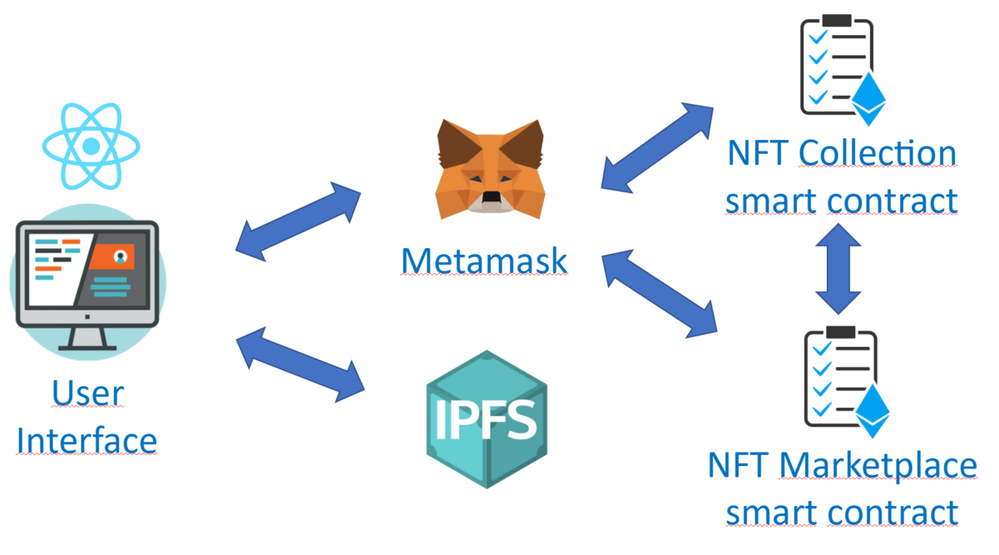
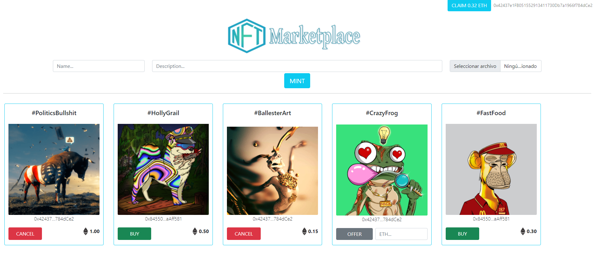

`#Ethereum`

# Dapp demo

This is an open decentralizedapplication built with smart contracts powered by Ethereum, including 2 part:

- Private-Sale demo: user can transfer money into publisher’s wallet, the transaction hash can be used for authentication and guaranteed benefit for the user

- Marketplace demo:  It basically consists of an open platform where each user can mint his own NFT and expose it on a marketplace.


## Table of Contents

- [The Project](#the-project)
- [Resources](#resources)


### Installing

First, you will need to install the dependencies with: `npm install`.

Run the following command in your terminal after cloning the main repo:

```
$ npm install
```

Then, you will need to install Truffle globally by running the following command int your terminal:

```
$ npm install -g truffle
```

### Running the Tests

First, you will have to compile the smart contracts by running the following command in your terminal:

```
$ truffle compile
```

Then you will have to install and run Ganache to run your blockchain locally:

https://www.trufflesuite.com/ganache

Then, the tests that validate your solution can be executed by runing the following
command:

```
$ truffle test
```

### Deployment on Local Blockchain

Deploy the contracts on your Ganache local blockchain by running the following command:

```
$ truffle migrate
```

### Opening the User Interface

First of all, it is required to install Metamask wallet as a browser extension: https://metamask.io/

Then you should configure Metamask to connect to your local blockchain run by Ganache. This requires the following:
- Open Metamask
- Open the Network Configuration panel
- Open Custom RPC
- Configure your private network by adding `http://localhost:7545` on the URL and `1337` as a chain ID.
- Import the first Ganache Account to Metamask by copying the Account Private Key from Ganache and pasting it on Metamask

Finally you just need to run the following command in your terminal to open the User Interface:

```
$ npm start
```


### Technology stack

- `Solidity`
- `React.js`
- `Truffle`
- `Web3.js`
- `Ganache`
- `Node.js`
- `Metamask`

## The Project

This project consists in an open platform where each user can mint his own NFT and expose it on a marketplace by making an offer or buying NFT from others. It includes:

- A smart contract which represents a collection of NFTs by following the ERC-721 standard
- A smart contract which represents the NFT Marketplace and contains all the logic to make offers, fill offers...
- Tests built with JavaScripts to ensure smart contracts are accomplishing the expected functionalities
- A React.js front-end application as a user interface

### Project architecture



The user can access the application via web-browser, and he must have the Metamask wallet installed. This interface, built with React.js, relies on the web3.js library to communicate with the smart contracts through Metamask. This means that the data reflected on the front-end application is fetched from the Ethereum blockchain. Each action performed by the user (mint a NFT, offer NFT, buy NFT...) creates a transaction on Ethereum, which will require Metamask confirmation and pay a small fee, and this transaction will permanently modify the state of the NFTCollection and NFTMarketplace smart contracts. On top of it, the user will upload the NFT Metadata to the IPFS, creating a permanent hash which will be permanently recorded on the blockchain itself to prove ownership.

## Function



The user can perform the following actions on this demo:


### Privatesale:
#### Donate

The user will input the number that they want to buy in the round. The money will be transfer into  publisher’s wallet, the whitelist and the threshold will be added into smart contract later 

### NFT-marketpace
#### Mint

The user must input a name, description and upload a file (image) to mint his own NFT. Once minted, a representation of this NFT will be displayed in the marketplace and initially it will be owned by its creator. This is open for everyone, meaning everyone can participate in this NFT creation within this collection. 

#### Make Offer

The user can offer his NFT by specifying its price (in Ether). If someone fulfills this offer, then the ownership is transferred to a new owner. 

#### Cancel Offer

The user can cancel an offer he did in the past if in the end he does not want to sell his NFT or wants to adjust the price.

#### Buy

A user can buy those NFT which someone else offered. This will require paying the requested price (the Ether will be transferred to the smart contract to be claimed later on).

#### Claim Funds

If a user sold an NFT, he can claim his funds by clicking the button in the top-right.

## Resources

- [ethereum.org](https://ethereum.org/)
- [truffle suit](https://www.trufflesuite.com/)
- [node.js](https://nodejs.org/)
- [web3.js](https://web3js.readthedocs.io/)
- [react.js](https://reactjs.org/)
- [IPFS](https://ipfs.io/)